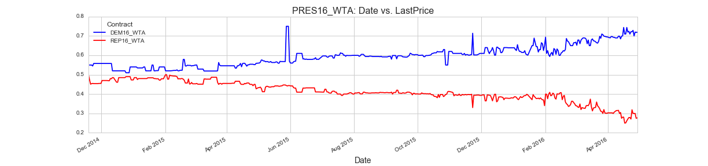
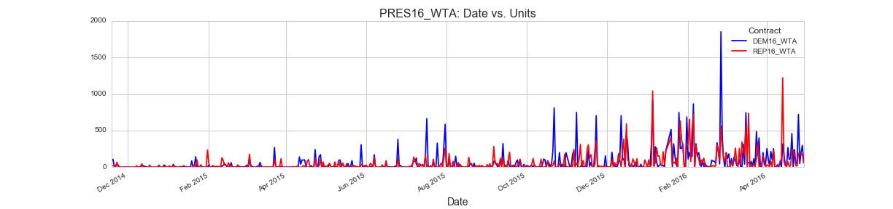

# Iowa Electronic Markets Scraper

2016 U.S. Presidential Election Markets

- PRES16_WTA: https://iemweb.biz.uiowa.edu/WebEx/marketinfo_english.cfm?Market_ID=362
- PRES16_VS: https://iemweb.biz.uiowa.edu/WebEx/marketinfo_english.cfm?Market_ID=361



See More: http://nbviewer.jupyter.org/gist/AlJohri/3b99f3132cba41147f08938a8d0f5c08

## Usage

```
python web.py
```

## Setup

```
conda env create -f environment.yaml
source activate iem
```

or

```
pip install -r requirements.txt
```

-----------------------------------------------------------------------

## Usage with Docker

```
./docker-run
```

## Setup with Docker

```
./docker-build
```

